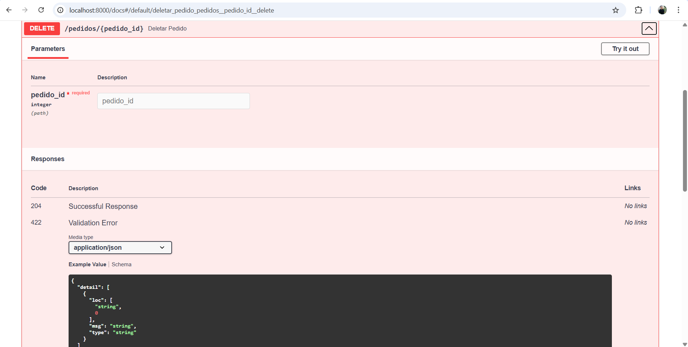

# API de Gerenciamento de Pedidos — Willy

Este projeto é uma réplica estudada e testada da API fornecida pelo professor Claudio Ulisses.  
Ele implementa um CRUD completo de pedidos usando:

- FastAPI  
- SQLAlchemy  
- Pydantic  
- Swagger UI  
- Uvicorn  

---

# Tecnologias Usadas

[](https://www.python.org/)
[](https://fastapi.tiangolo.com/)
[](https://docs.sqlalchemy.org/)
[](https://www.uvicorn.org/)
[](https://docs.pydantic.dev/)

---

# Estrutura do Projeto

IWS/
└── rest/
├── app.py
├── config/
├── models/
├── repositories/
├── services/
├── controllers/
└── schemas/


---

# Como Executar o Projeto

# 1. Instale as dependências


```bash
pip install -r requirements.txt

ou 

pip install fastapi uvicorn sqlalchemy pydantic


# 2. Rode o servidor

python app.py

# 3️. Acesse o Swagger UI

🔗 http://localhost:8000/docs

🔗 http://localhost:8000/redoc


# Observações

API testada e validada com sucesso.

Rotas funcionando em ambiente local.

Código replicado do exemplo proposto pelo professor para estudo.

# Repositório do Projeto

https://github.com/WillyFortunasc/MeusProjetos_Python/tree/main/Rest_willy.pedidos

## Tela do Swagger UI





